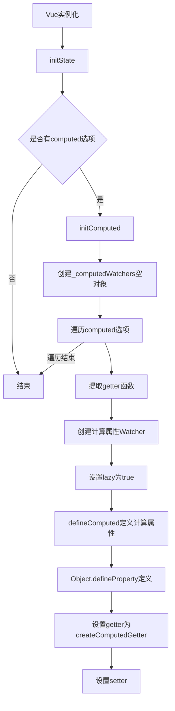
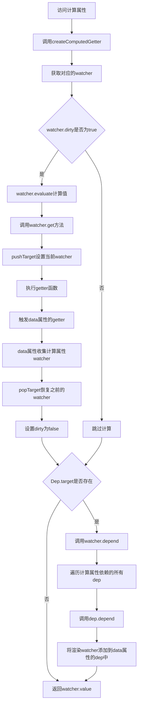
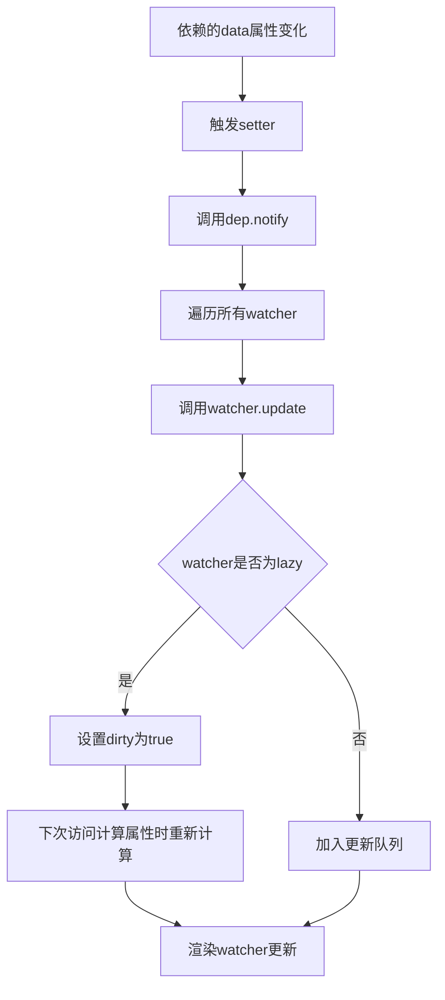
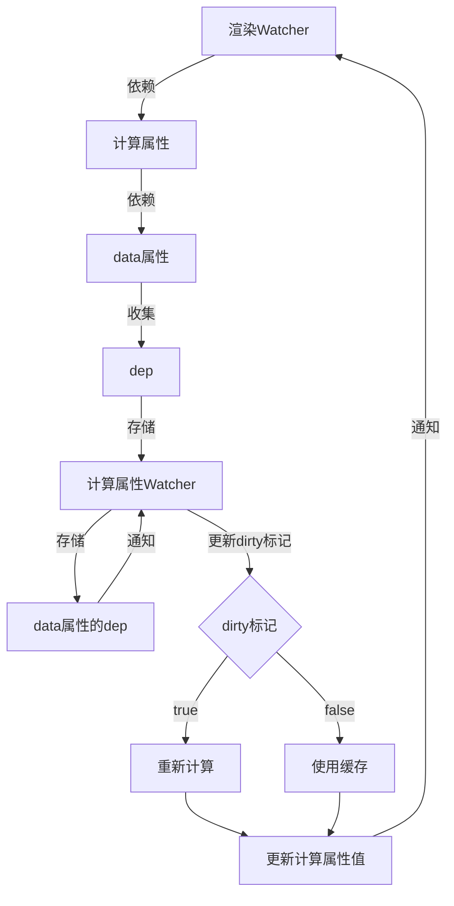
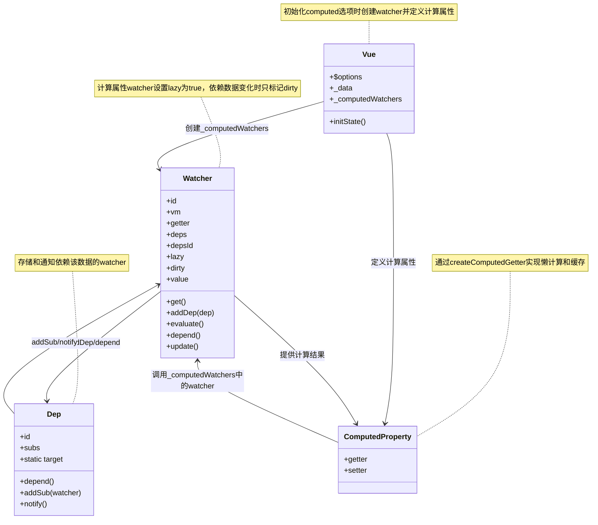

## 初始化流程

## 计算属性的计算和依赖收集流程

## 计算属性的更新流程

## watcher、dep 与 computed 的关系

## 类之间的调用关系

## 计算属性的特点总结：
1. **懒计算**：计算属性只有在被访问时才会计算
2. **缓存**：计算结果会被缓存，只有依赖变化时才会重新计算
3. **依赖追踪**：自动收集计算过程中访问的响应式数据作为依赖
4. **依赖传递**：将计算属性的依赖传递给渲染 watcher，形成依赖链

