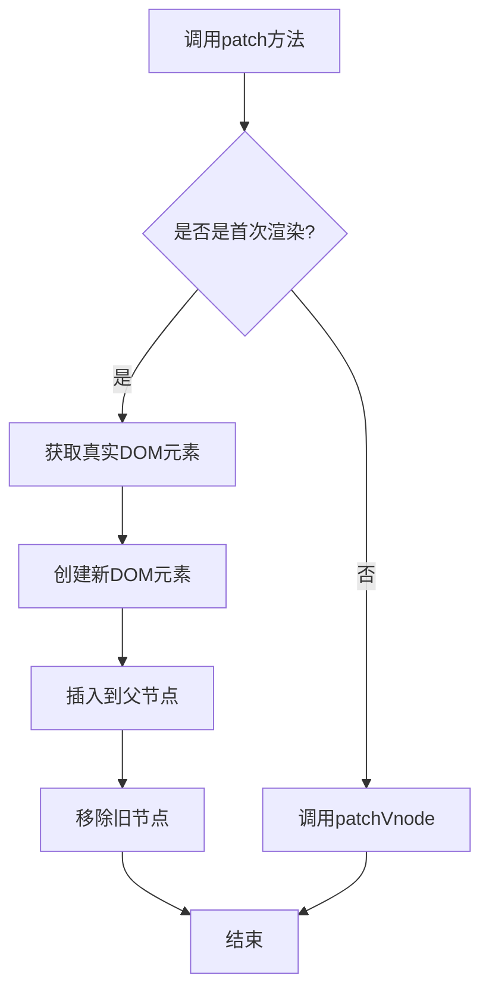
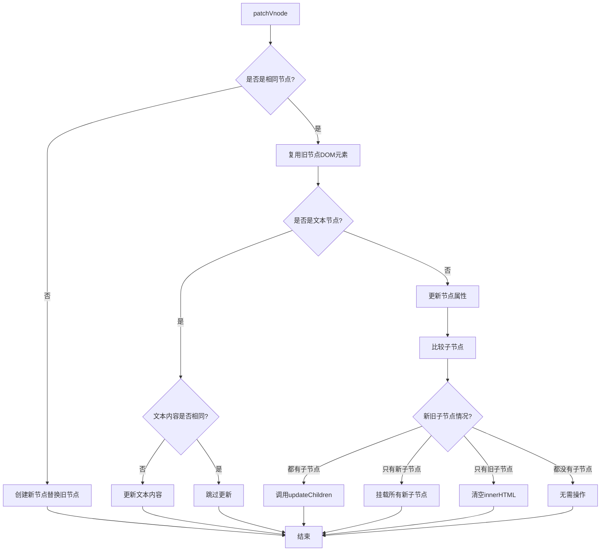
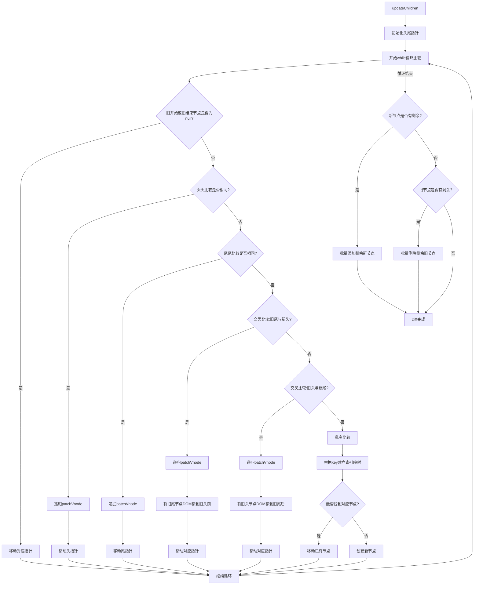
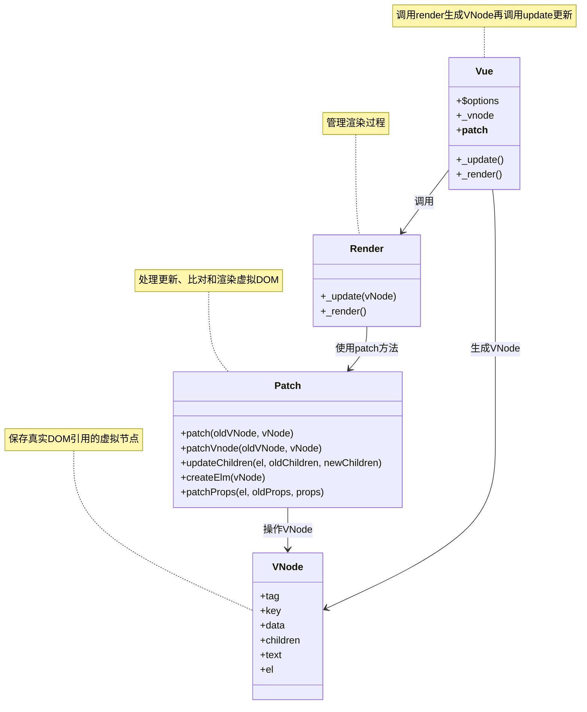
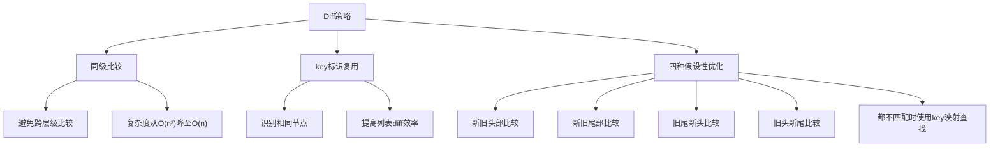

## patch 更新流程

## patchVnode 核心流程

## updateChildren 双指针Diff算法

## 虚拟DOM和Diff关系图

## Diff算法的核心策略

## Diff算法的特点总结：
1. **同级比较**：只比较同一层级的节点，不做跨层级比较
2. **高效识别**：通过tag和key快速识别相同节点
3. **双端比较**：采用双指针法从两端向中间比较，优化常见DOM操作场景
4. **映射复用**：对于乱序的情况，通过key建立映射以提高查找效率
5. **就地复用**：尽可能复用已有DOM节点，减少DOM操作

