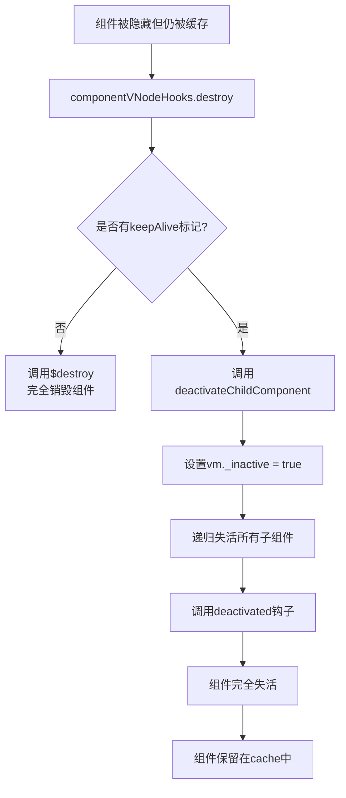
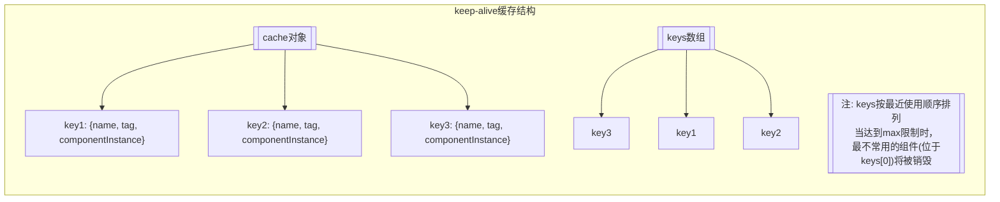

本文档详细说明了 Vue 2.6.14 中 keep-alive 组件的缓存机制以及被缓存组件重新渲染的完整流程。

## 1. 缓存机制
keep-alive 组件的基本工作原理如下：

### 初始化阶段
```javascript
created () {
  this.cache = Object.create(null)
  this.keys = []
}
```

keep-alive 组件在创建时初始化一个空的 cache 对象和 keys 数组，用于存储被缓存的组件实例。

### 缓存过程
当包含在 keep-alive 内的组件第一次渲染时：

1. keep-alive 的 render 函数会检查该组件是否符合 include/exclude 条件
2. 为符合条件的组件设置缓存标记，并准备将组件加入缓存：

```javascript
vnode.data.keepAlive = true;
this.vnodeToCache = vnode;
this.keyToCache = key;
```

3. 在 mounted 和 updated 钩子中，调用 cacheVNode 方法保存组件实例：

```javascript
cache[keyToCache] = {
  name: getComponentName(componentOptions),
  tag,
  componentInstance,
};
keys.push(keyToCache);
```

4. 如果配置了 max 属性并且缓存数量超过限制，会移除最旧的组件缓存。

## 2. 组件从缓存中激活的流程
当经过 keep-alive 缓存的组件重新被渲染显示时，初始化流程如下：

### 阶段一：VNode 创建和初始化
1. 当父组件重新渲染包含 keep-alive 的 VNode 时，会再次执行 keep-alive 的 render 函数
2. render 函数检查缓存中是否已有该组件：

```javascript
if (cache[key]) {
  vnode.componentInstance = cache[key].componentInstance;
  // 将该 key 提到 keys 数组末尾，表示最新使用
  remove(keys, key);
  keys.push(key);
}
```

3. 如果找到缓存，则直接使用缓存中的组件实例，而不是创建新的实例
4. 设置 `vnode.data.keepAlive = true`，标记这是个被缓存的组件

### 阶段二：组件 VNode 的初始化钩子
在组件 VNode 的初始化钩子 componentVNodeHooks.init 中，检测到是 keep-alive 缓存的组件：

```javascript
if (
  vnode.componentInstance &&
  !vnode.componentInstance._isDestroyed &&
  vnode.data.keepAlive
) {
  // kept-alive components, treat as a patch
  const mountedNode: any = vnode;
  componentVNodeHooks.prepatch(mountedNode, mountedNode);
}
```

此时不会重新创建组件实例，而是调用 prepatch 钩子函数进行更新。

### 阶段三：组件更新
1. 在 prepatch 钩子中，调用 updateChildComponent 函数更新组件：

```javascript
updateChildComponent(
  child,
  options.propsData, // 更新 props
  options.listeners, // 更新监听器
  vnode, // 新的父 vnode
  options.children // 新的子节点
);
```

2. updateChildComponent 函数会更新组件的属性：
    - 更新组件引用关系 ($vnode, _vnode.parent 等)
    - 更新 listeners
    - 更新 props 属性
    - 更新事件监听器
    - 解析插槽并在需要时强制更新
3. 重要的是，这个过程**不会触发组件的 beforeCreate、created、beforeMount 和 mounted** 钩子函数，因为组件实例并没有重新创建和挂载。

### 阶段四：组件激活
1. 在 componentVNodeHooks.insert 钩子函数中，检测到 keepAlive 标记：

```javascript
if (vnode.data.keepAlive) {
  if (context._isMounted) {
    // 父组件已挂载，将组件加入激活队列
    queueActivatedComponent(componentInstance);
  } else {
    // 父组件首次挂载，直接激活
    activateChildComponent(componentInstance, true /* direct */);
  }
}
```

2. 根据父组件是否已挂载，有两种处理方式：
    - 如果父组件已挂载，则调用 queueActivatedComponent 将组件加入激活队列
    - 如果是父组件首次挂载，则直接调用 activateChildComponent 激活组件
3. 组件加入激活队列后，会在所有 DOM 更新完成后，在调度器的 flushSchedulerQueue 函数执行后期处理：

```javascript
// 调用组件的 activated 和 updated 钩子
callActivatedHooks(activatedQueue);
callUpdatedHooks(updatedQueue);
```

4. 在 callActivatedHooks 中，会调用 activateChildComponent 方法激活组件：

```javascript
function callActivatedHooks(queue) {
  for (let i = 0; i < queue.length; i++) {
    queue[i]._inactive = true;
    activateChildComponent(queue[i], true);
  }
}
```

5. activateChildComponent 方法会递归激活组件及其所有子组件，并调用 activated 钩子：

```javascript
export function activateChildComponent(vm: Component, direct?: boolean) {
  // ...
  vm._inactive = false;
  for (let i = 0; i < vm.$children.length; i++) {
    activateChildComponent(vm.$children[i]);
  }
  callHook(vm, "activated");
}
```

## 3. 失活过程
当组件被隐藏但仍被 keep-alive 缓存时：

1. 在 componentVNodeHooks.destroy 钩子中，检测到 keepAlive 标记：

```javascript
if (!vnode.data.keepAlive) {
  componentInstance.$destroy();
} else {
  deactivateChildComponent(componentInstance, true /* direct */);
}
```

2. 调用 deactivateChildComponent 使组件失活，而不是销毁：

```javascript
export function deactivateChildComponent(vm: Component, direct?: boolean) {
  // ...
  vm._inactive = true;
  for (let i = 0; i < vm.$children.length; i++) {
    deactivateChildComponent(vm.$children[i]);
  }
  callHook(vm, "deactivated");
}
```

3. deactivateChildComponent 会递归使组件及其所有子组件失活，并调用 deactivated 钩子

## 4. 流程图
### 组件缓存和重新渲染流程


### 组件失活流程


### 生命周期对比

```mermaid
flowchart TD
    subgraph "完整组件生命周期"
        A1[beforeCreate] --> B1[created]
        B1 --> C1[beforeMount]
        C1 --> D1[mounted]
        D1 --> E1[beforeUpdate]
        E1 --> F1[updated]
        F1 --> G1[beforeDestroy]
        G1 --> H1[destroyed]
    end

    subgraph "keep-alive组件生命周期(首次)"
        A2[beforeCreate] --> B2[created]
        B2 --> C2[beforeMount]
        C2 --> D2[mounted]
        D2 --> E2[activated]
        E2 -.-> F2[正常更新流程]
        F2 -.-> G2[deactivated]
    end

    subgraph "keep-alive组件再次激活"
        X[从cache中恢复组件] --> Y[更新props/事件/插槽]
        Y --> Z[activated]
        Z -.-> W[正常更新流程]
        W -.-> V[deactivated]
    end
```


### 缓存结构


## 5. 总结
经过 keep-alive 缓存过的组件重新渲染时的初始化流程：

1. **组件实例复用**：不会创建新的组件实例，而是直接复用之前缓存的实例
2. **属性更新**：通过 updateChildComponent 函数更新组件的 props、事件监听器等属性
3. **不触发生命周期**：不会触发 beforeCreate、created、beforeMount、mounted 钩子函数
4. **激活过程**：
    - 组件被插入到 DOM 中时会触发 insert 钩子
    - 标记组件需要激活并加入激活队列
    - DOM 更新完成后执行激活操作
    - 调用组件的 activated 钩子函数（递归激活子组件）
5. **状态保留**：组件的数据状态（如 data、computed、vuex 状态等）完全保留

这个机制使得 keep-alive 缓存的组件能够在重新显示时快速呈现，同时保留之前的状态，提高用户体验和性能。但开发者需要注意，由于不会触发完整的生命周期，某些需要在 mounted 中执行的逻辑可能需要改写到 activated 钩子中。

## 6. 开发实践注意事项
1. **钩子函数位置**：
    - 需要在组件重新显示时执行的逻辑应该放在 activated 钩子中，而不是 mounted
    - 组件被隐藏时的清理工作应放在 deactivated 中，而不是 beforeDestroy
2. **缓存控制**：
    - 使用 include/exclude 属性控制哪些组件需要被缓存
    - 使用 max 属性控制最大缓存数量，避免内存泄漏
3. **组件状态**：
    - 被缓存的组件所有的数据状态都会被保留
    - 如果某些状态不希望被缓存，可以在 deactivated 钩子中重置，或在 activated 钩子中重新初始化

