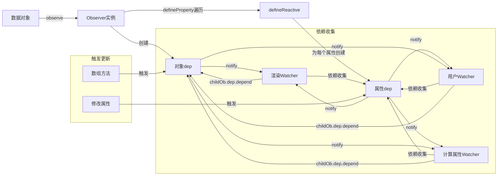
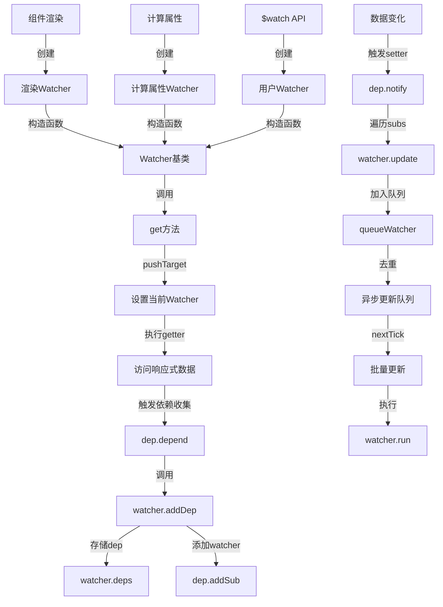
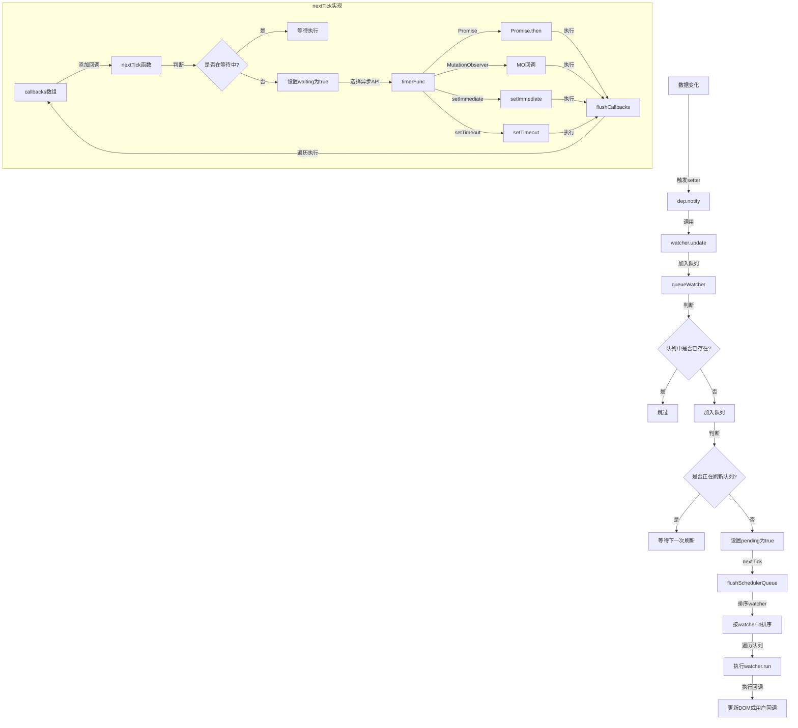
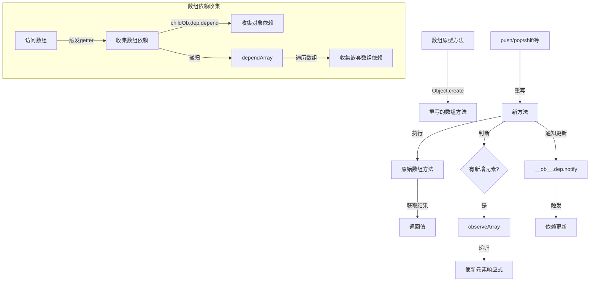

本文档通过流程图展示 Vue2 响应式系统的核心实现原理，包括双重依赖收集设计和异步更新队列机制。

## 响应式系统整体架构

## 双重依赖收集设计原理
在 Vue2 响应式系统中存在两种依赖收集器，这种双重依赖设计是 Vue2 响应式系统的核心，解决了 JavaScript 本身对象变化检测的局限性。

### 属性 dep 与对象 dep 的区别
| 特性 | 属性 dep | 对象 dep |
| --- | --- | --- |
| 创建时机 | 在 defineReactive 函数中为每个属性创建 | 在 Observer 构造函数中为整个对象创建 |
| 存储位置 | 闭包中的局部变量 | Observer 实例上，通过**ob**属性访问 |
| 收集对象 | 谁用了这个具体属性 | 谁用了这个对象/数组 |
| 触发时机 | 属性值变化时 | 对象/数组操作方法调用时 |
| 主要作用 | 处理对象属性的依赖 | 处理数组方法和对象变化 |

## 观察者模式实现

## 异步更新队列机制
Vue 的更新是异步的，当数据变化时，Vue 将开启一个队列，将同一事件循环中的所有数据变更缓存起来，最终通过 Promise、MutationObserver、setImmediate 或 setTimeout 等方式在下一个事件循环中批量更新。

## 数组方法重写
Vue 重写了数组的七个变异方法，使它们能够触发视图更新并处理新增元素的响应式。

