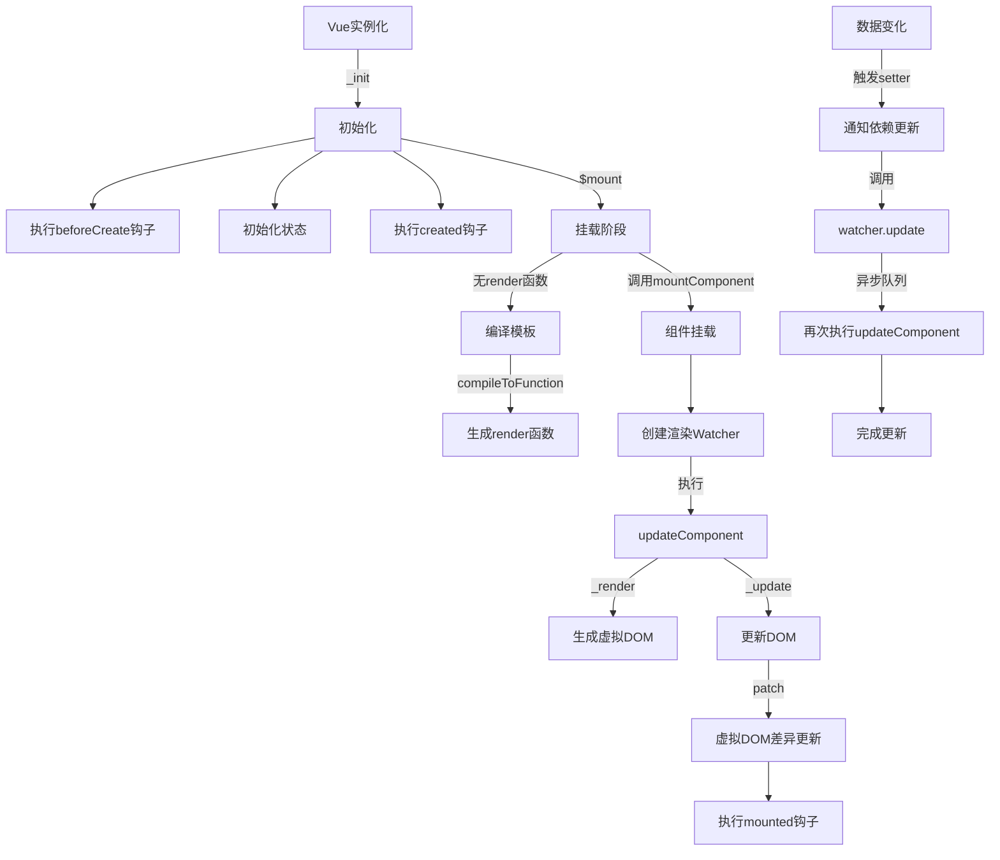
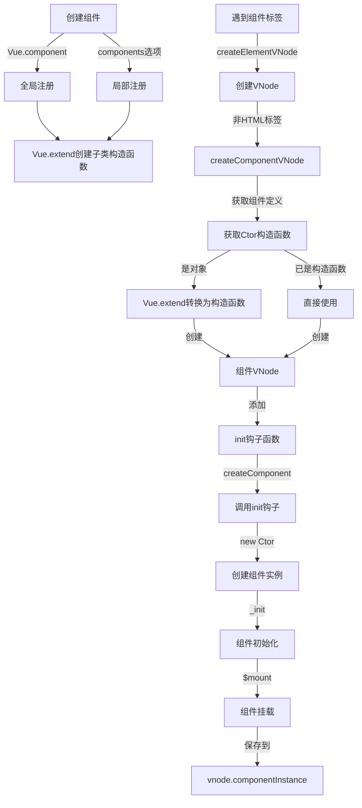
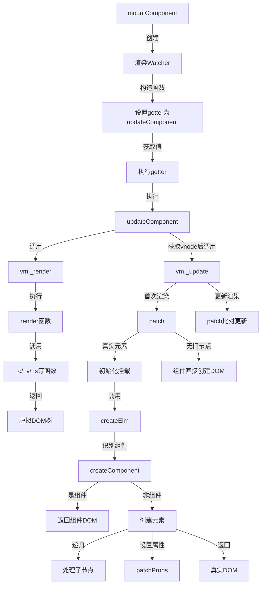
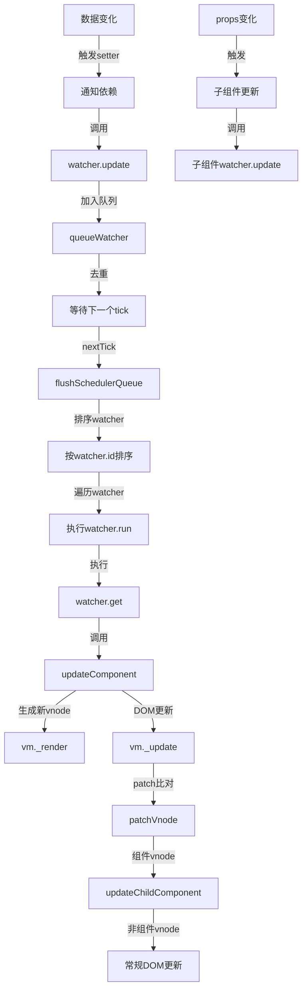

本文档通过流程图展示 Vue2 组件渲染的核心实现原理，包括组件的创建、挂载和更新过程。

## 组件渲染整体流程

## 组件创建和实例化过程

## 组件挂载和渲染详细流程

## 组件更新流程

## 组件渲染中的核心类和方法
| 核心类/方法 | 职责 |
| --- | --- |
| Vue.extend | 创建组件构造函数，继承 Vue |
| createComponent | 创建组件 VNode，处理组件初始化逻辑 |
| mountComponent | 组件挂载的核心函数，创建渲染 Watcher |
| _render | 调用 render 函数生成虚拟 DOM |
| _update | 将虚拟 DOM 转换为真实 DOM |
| patch | 对比新旧虚拟 DOM，更新真实 DOM |
| Watcher | 负责组件的渲染和更新 |

## 组件渲染的关键步骤
1. **组件定义**: 通过 Vue.component 或 components 选项定义组件
2. **组件构造函数创建**: 使用 Vue.extend 创建组件构造函数
3. **虚拟节点创建**: 遇到组件标签时创建组件类型的虚拟节点
4. **组件实例化**: 在 patch 过程中通过 createComponent 初始化组件
5. **组件挂载**: 调用组件实例的$mount 方法
6. **模板编译**: 如果没有 render 函数，编译 template 为 render 函数
7. **渲染函数执行**: 调用 render 函数生成虚拟 DOM
8. **DOM 渲染**: 通过 patch 将虚拟 DOM 转换为真实 DOM
9. **组件更新**: 当依赖数据变化时，触发组件重新渲染

